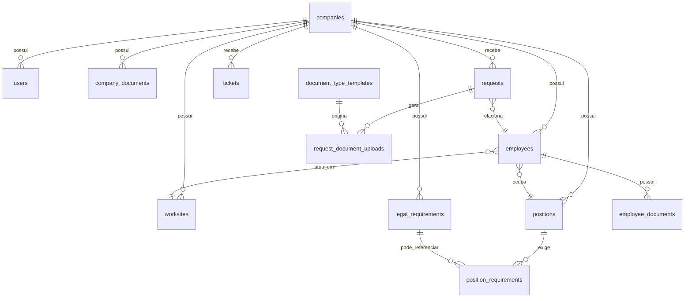

# Documentação Completa do Sistema SmartDocPlan

Data de referência: 28/06/2026  
Repositório analisado: `C:\Projetos\Atenza\smartdocplan`

## 1. Visão geral

O SmartDocPlan é uma plataforma web para gestão documental e operacional de rotinas de RH, com foco em:

- abertura e acompanhamento de solicitações de RH;
- controle documental de empresas e colaboradores;
- gestão de requisitos legais e obrigatoriedades por função;
- acompanhamento de chamados;
- trilha de auditoria;
- dashboards operacionais da empresa e da plataforma.

O sistema foi estruturado para operar em dois contextos principais:

- visão de plataforma, onde usuários da operação central gerenciam várias empresas;
- visão da empresa, onde usuários vinculados a uma empresa operam apenas o seu próprio escopo.

O produto mistura componentes de compliance documental, workflow operacional e cadastros auxiliares para que a abertura de processos de RH já considere documentos, treinamentos, exames e itens psicossociais relacionados ao contexto da empresa e da função.

## 2. Objetivo de negócio

O sistema existe para centralizar processos de RH que normalmente ficam espalhados entre planilhas, e-mails, pastas e mensagens avulsas.

Na prática, ele permite:

- abrir processos como admissão, demissão, mudança de função, afastamento e atestado médico;
- atrelar esses processos a uma empresa, a uma pessoa e a uma função;
- puxar documentos-base do checklist documental;
- puxar treinamentos, exames e itens psicossociais configurados por função;
- permitir anexos tanto no momento da abertura quanto na etapa de avaliação;
- registrar status, observações e auditoria das ações realizadas;
- manter um dossiê documental do colaborador e documentos da empresa.

## 3. Stack e arquitetura

## 3.1 Frontend

- React 19
- TypeScript
- Vite
- Tailwind CSS
- Radix UI
- Wouter
- Sonner

## 3.2 Backend

- Node.js 22
- Express
- tRPC v11
- Drizzle ORM
- PostgreSQL via `pg`
- Zod para validação de entrada

## 3.3 Banco de dados

- PostgreSQL
- schema principal definido em [drizzle/schema.ts](/C:/Projetos/Atenza/smartdocplan/drizzle/schema.ts)
- conexão lazy via `DATABASE_URL`

## 3.4 Build e deploy

- build fullstack com `vite build` no frontend e `esbuild` no backend
- execução em produção via `node dist/index.js`
- container Docker escutando internamente em `5000`
- `docker-compose.yml` preparado para uso com proxy reverso

Arquivos principais:

- [package.json](/C:/Projetos/Atenza/smartdocplan/package.json)
- [Dockerfile](/C:/Projetos/Atenza/smartdocplan/Dockerfile)
- [docker-compose.yml](/C:/Projetos/Atenza/smartdocplan/docker-compose.yml)

## 4. Organização do projeto

- `client/`: aplicação frontend
- `server/`: backend, rotas tRPC, autenticação e boot do servidor
- `drizzle/`: schema tipado do banco
- `shared/`: constantes, tipos compartilhados, validações e permissões
- `docs/`: documentação e entregas
- `dist/`: build gerado para produção

Arquivos importantes:

- [client/src/App.tsx](/C:/Projetos/Atenza/smartdocplan/client/src/App.tsx)
- [server/_core/index.ts](/C:/Projetos/Atenza/smartdocplan/server/_core/index.ts)
- [server/routers.ts](/C:/Projetos/Atenza/smartdocplan/server/routers.ts)
- [server/db.ts](/C:/Projetos/Atenza/smartdocplan/server/db.ts)
- [shared/permissions.ts](/C:/Projetos/Atenza/smartdocplan/shared/permissions.ts)
- [shared/formValidation.ts](/C:/Projetos/Atenza/smartdocplan/shared/formValidation.ts)

## 5. Autenticação e sessão

## 5.1 Modelo de autenticação atual

O sistema usa autenticação local por e-mail e senha.

Fluxo atual:

- `POST /api/auth/login`
- `POST /api/auth/logout`
- `GET /api/auth/me`

Arquivos de referência:

- [server/_core/localAuth.ts](/C:/Projetos/Atenza/smartdocplan/server/_core/localAuth.ts)
- [server/_core/context.ts](/C:/Projetos/Atenza/smartdocplan/server/_core/context.ts)
- [server/_core/cookies.ts](/C:/Projetos/Atenza/smartdocplan/server/_core/cookies.ts)

## 5.2 Sessão

- a sessão é gravada em cookie HTTP-only;
- o cookie é assinado com `JWT_SECRET`;
- o token carrega `userId` e `type: "local"`;
- o backend resolve o usuário a partir do cookie a cada requisição tRPC;
- `sameSite` e `secure` são ajustados conforme o protocolo real da requisição.

Ponto importante:

- o código foi ajustado para não marcar o cookie como `Secure` quando o acesso público estiver em HTTP, evitando o problema clássico de login que volta para a tela inicial.

## 5.3 Seed inicial

Ao subir o backend, o sistema tenta criar um administrador padrão se ele ainda não existir.

Usuário inicial:

- e-mail: `admin@smartdocplan.com`
- senha: `Admin@2024!`
- perfil: `platform_admin`

## 5.4 OAuth

Existem trechos de compatibilidade com OAuth no código, mas o fluxo ativo da aplicação hoje é autenticação local por e-mail e senha.

## 6. Perfis e permissões

Perfis cadastrados em [shared/permissions.ts](/C:/Projetos/Atenza/smartdocplan/shared/permissions.ts):

- `platform_admin`
- `platform_analyst`
- `platform_auditor`
- `company_admin`
- `company_hr`
- `company_manager`
- `company_viewer`

## 6.1 Regras resumidas por perfil

### `platform_admin`

- acesso total à plataforma;
- cria e edita empresas;
- cria e gerencia usuários;
- gerencia checklist de documentos;
- gerencia matriz legal;
- pode abrir solicitações;
- pode avaliar solicitações e documentos;
- pode visualizar auditoria e BI global;
- quando abre uma solicitação, escolhe primeiro a empresa de destino.

### `platform_analyst`

- acesso à visão de plataforma;
- pode operar dados de empresa;
- pode avaliar fluxo de solicitações e chamados;
- pode atuar operacionalmente, mas não possui poderes de superadmin.

### `platform_auditor`

- acesso à visão de plataforma;
- perfil majoritariamente de leitura;
- não é perfil de abertura de solicitações nem de alteração operacional relevante.

### `company_admin`

- opera a própria empresa;
- pode abrir solicitações;
- pode gerenciar cadastros da empresa;
- pode abrir chamados;
- pode acessar configurações da empresa.

### `company_hr`

- opera a própria empresa;
- pode abrir solicitações;
- pode gerenciar dados da empresa;
- pode abrir chamados;
- pode acessar configurações da empresa.

### `company_manager`

- acesso limitado ao escopo da empresa;
- pode abrir chamados;
- não abre solicitações de RH.

### `company_viewer`

- somente leitura;
- não abre solicitações;
- não altera workflow;
- não gerencia dados.

## 6.2 Helpers de permissão usados no código

- `isPlatformUser`
- `isCompanyUser`
- `isPlatformOperator`
- `isPlatformAuditor`
- `canManageCompanyData`
- `canCreateRequests`
- `canManageRequestWorkflow`
- `canCreateTickets`
- `canManagePlatformSettings`
- `canSeeAdminManagement`
- `canSeeCompanySettings`

## 7. Rotas e navegação da aplicação

Arquivo principal: [client/src/App.tsx](/C:/Projetos/Atenza/smartdocplan/client/src/App.tsx)

## 7.1 Rotas públicas

- `/`
- `/login`

Quando o usuário já está autenticado:

- perfis de plataforma são redirecionados para `/admin`;
- perfis de empresa são redirecionados para `/empresa`.

## 7.2 Rotas da plataforma

- `/admin`
- `/admin/empresas`
- `/admin/empresas/:id`
- `/admin/solicitacoes`
- `/admin/solicitacoes/nova`
- `/admin/chamados`
- `/admin/auditoria`
- `/admin/bi`
- `/admin/usuarios`
- `/admin/configuracoes`
- `/admin/documentos`
- `/admin/matriz-legal`

## 7.3 Rotas da empresa

- `/empresa`
- `/empresa/solicitacoes/nova`
- `/empresa/solicitacoes`
- `/empresa/colaboradores`
- `/empresa/colaboradores/:id`
- `/empresa/pendencias`
- `/empresa/chamados`
- `/empresa/bi`
- `/empresa/configuracoes`

## 8. Módulos funcionais

## 8.1 Dashboard global da plataforma

Tela principal administrativa: "Visão Geral da Plataforma".

Apresenta:

- empresas totais;
- empresas ativas;
- solicitações totais;
- solicitações novas;
- chamados abertos;
- colaboradores ativos.

Fonte dos dados:

- `dashboard.global`

## 8.2 Gestão de empresas

Tela: "Gestão de Empresas".

Capacidades:

- listar empresas;
- criar empresa;
- editar empresa;
- definir status da empresa;
- acessar detalhe da empresa;
- anexar e acompanhar documentos corporativos.

Status da empresa:

- `ativo`
- `inativo`
- `suspenso`

Validações:

- CNPJ com máscara e validação;
- telefone com máscara e validação;
- e-mail opcional validado quando informado.

## 8.3 Documentos da empresa

Componente principal: [client/src/components/CompanyDocumentsManager.tsx](/C:/Projetos/Atenza/smartdocplan/client/src/components/CompanyDocumentsManager.tsx)

Documentos corporativos previstos:

- `cartao_cnpj` - obrigatório
- `contrato_social` - obrigatório
- `pcmso` - obrigatório
- `pgr` - obrigatório
- `ltcat` - obrigatório
- `cno` - opcional

O módulo informa:

- total de documentos enviados;
- obrigatórios pendentes;
- vencidos;
- a vencer em 30 dias.

## 8.4 Colaboradores

Tela: "Colaboradores".

Capacidades:

- listar colaboradores da empresa;
- consultar dossiê do colaborador;
- cadastrar colaborador;
- atualizar dados básicos;
- alterar status.

Status do colaborador:

- `ativo`
- `afastado`
- `desligado`

## 8.5 Dossiê do colaborador

Tela: "Dossiê".

Objetivo:

- consolidar os documentos do colaborador;
- permitir leitura por categoria;
- acompanhar validade e pendências.

Categorias de documentos do colaborador:

- `pessoal`
- `contratual`
- `exame_medico`
- `treinamento`
- `advertencia`
- `afastamento`
- `atestado`
- `opcional`

## 8.6 Solicitações de RH

É o núcleo operacional da plataforma.

Tipos de solicitação:

- `admissao`
- `demissao`
- `mudanca_funcao`
- `afastamento`
- `atestado_medico`
- `outros`

Status de solicitação:

- `nova`
- `em_analise`
- `aguardando_correcao`
- `aguardando_documentos`
- `aprovado`
- `concluido`
- `rejeitado`

Prioridades:

- `baixa`
- `media`
- `alta`
- `urgente`

## 8.7 Chamados

Tipos:

- `criacao_usuario`
- `bloqueio_usuario`
- `alteracao_acesso`
- `suporte_tecnico`
- `duvida`
- `outros`

Status:

- `aberto`
- `em_atendimento`
- `aguardando_cliente`
- `resolvido`
- `fechado`

Prioridades:

- `baixa`
- `media`
- `alta`
- `urgente`

## 8.8 Matriz legal

Módulo usado para registrar requisitos legais por empresa.

Campos principais:

- norma;
- requisito;
- documento exigido;
- validade em meses;
- descrição;
- flag de ativo.

O módulo serve como base de contexto de compliance da empresa.

## 8.9 Requisitos por função

Este é um cadastro complementar e muito importante.

Ele vincula uma função a requisitos específicos por processo, com categorias:

- `treinamento`
- `exame_medico`
- `psicossocial`
- `outros`

Processos possíveis nesse vínculo:

- `admissao`
- `demissao`
- `mudanca_funcao`
- `todos`

Cada requisito por função pode ser:

- obrigatório ou opcional;
- ordenado;
- vinculado ou não a um requisito legal da matriz;
- configurado com validade em meses.

Na prática, é esse cadastro que faz a solicitação "puxar" treinamentos, exames e itens psicossociais no momento da abertura.

## 8.10 Checklist Docs

Módulo de modelos de documentos por tipo de solicitação.

Categorias disponíveis:

- `pessoal`
- `empresa`
- `treinamento`
- `exame_medico`
- `psicossocial`
- `outros`

Ele define o checklist base por tipo de processo.

## 8.11 Auditoria

Tela: "Log de Auditoria".

Objetivo:

- registrar ações relevantes da plataforma;
- manter rastreabilidade de alterações de empresas, solicitações, documentos, colaboradores e usuários.

## 8.12 BI

Existem duas frentes:

- BI global da plataforma;
- BI e relatórios da empresa.

No estado atual do código, os dados exibidos são principalmente indicadores agregados consultados diretamente do banco via router de dashboard.

## 9. Fluxo detalhado de solicitação de RH

Arquivo principal: [client/src/pages/empresa/EmpresaNovaSolicitacao.tsx](/C:/Projetos/Atenza/smartdocplan/client/src/pages/empresa/EmpresaNovaSolicitacao.tsx)

## 9.1 Quem pode abrir

Podem abrir solicitações:

- `platform_admin`
- `company_admin`
- `company_hr`

Não podem abrir:

- `platform_auditor`
- `company_manager`
- `company_viewer`

## 9.2 Estrutura do wizard

Etapas visíveis:

1. `company`
2. `process`
3. `person`
4. `hiring`
5. `requirements`
6. `review`

Observações:

- a etapa `company` só aparece para `platform_admin`;
- a etapa `hiring` só aparece para `admissao`;
- usuários da empresa iniciam direto em `process`.

## 9.3 Etapa 1 - Empresa

Somente para administrador da plataforma.

Objetivo:

- definir para qual empresa a solicitação será aberta.

## 9.4 Etapa 2 - Processo

O usuário escolhe o tipo de processo:

- admissão;
- demissão;
- mudança de função;
- afastamento;
- atestado médico;
- outros.

## 9.5 Etapa 3 - Pessoa

Campos principais:

- CPF
- nome
- função
- frente/local
- data de nascimento
- prioridade

Regras:

- CPF é obrigatório e precisa ser válido;
- nome é obrigatório;
- função é obrigatória;
- data de nascimento, quando informada, deve respeitar idade mínima de 12 anos;
- para processos diferentes de `admissao` e `outros`, o CPF precisa já existir no banco.

Comportamento do CPF:

- o sistema tenta localizar colaborador existente pelo CPF;
- se encontrar, autofill de dados como nome, função, frente/local e data de nascimento quando aplicável.

Cadastros auxiliares disponíveis nessa etapa:

- cadastrar função;
- cadastrar frente/local.

## 9.6 Etapa 4 - Contratação

Aparece somente em admissão.

Campos conceituais:

- formato de trabalho;
- prazo do contrato;
- demais observações relacionadas à contratação.

Formatos de trabalho previstos no frontend:

- `clt_presencial`
- `clt_remoto`
- `clt_intermitente`
- `jovem_aprendiz`
- `estagio`

Prazos de contrato:

- `prazo_indeterminado`
- `prazo_determinado`
- `experiencia`

Essas informações hoje compõem principalmente a descrição detalhada da solicitação.

## 9.7 Etapa 5 - Requisitos

Essa etapa consolida duas fontes principais:

- Checklist Docs do tipo de solicitação;
- requisitos por função e processo.

Na interface, isso aparece como:

- checklist documental puxado pelo tipo de solicitação;
- treinamentos, exames e itens psicossociais puxados pela função;
- contexto complementar da matriz legal da empresa.

Importante:

- os uploads podem ser feitos já na abertura da solicitação;
- os anexos também podem ser avaliados depois por quem faz a análise;
- os arquivos preparados nessa etapa ficam em memória até a abertura final da solicitação;
- ao salvar a solicitação, os uploads preparados são enviados para a tabela de uploads do processo.

## 9.8 Etapa 6 - Revisão

Objetivo:

- exibir resumo da solicitação;
- consolidar empresa, processo, pessoa, vínculo, função, frente/local e quantidade de anexos preparados;
- confirmar a abertura.

## 9.9 O que acontece no backend ao abrir a solicitação

No backend, ao criar a solicitação:

1. o sistema valida acesso à empresa;
2. valida se o perfil pode abrir solicitações;
3. insere o registro em `requests`;
4. se houver `positionId`, busca requisitos ativos da função na tabela `position_requirements`;
5. filtra requisitos pelo processo compatível;
6. cria placeholders em `request_document_uploads` com status `pendente`;
7. grava auditoria da abertura;
8. retorna o `id` da nova solicitação;
9. o frontend sobe os anexos preparados e preenche placeholders quando houver correspondência.

## 9.10 Observação importante sobre obrigatoriedade

O código atual permite anexar documentos na abertura e na avaliação, mas a obrigatoriedade do checklist não bloqueia rigidamente a abertura no backend. O sistema registra e organiza os itens, porém a consistência operacional depende do fluxo de avaliação e do uso correto do checklist.

## 10. Fluxo de avaliação de solicitações

Tela principal: [client/src/pages/admin/AdminSolicitacoes.tsx](/C:/Projetos/Atenza/smartdocplan/client/src/pages/admin/AdminSolicitacoes.tsx)

Capacidades:

- visualizar em kanban;
- visualizar em lista;
- filtrar por empresa;
- filtrar por tipo;
- pesquisar por texto;
- abrir detalhe da solicitação;
- alterar status;
- revisar documentos anexados.

Status sugeridos pela UI:

- `nova` -> `em_analise`, `aguardando_documentos`, `rejeitado`
- `em_analise` -> `aguardando_documentos`, `aguardando_correcao`, `aprovado`, `rejeitado`
- `aguardando_documentos` -> `em_analise`, `aprovado`, `rejeitado`
- `aguardando_correcao` -> `em_analise`, `rejeitado`
- `aprovado` -> `concluido`, `rejeitado`

Ponto técnico importante:

- essa matriz está implementada na interface administrativa;
- o backend restringe quem pode mudar status, mas não aplica uma máquina de estados rígida equivalente à UI.

Quem pode alterar status:

- perfis com `canManageRequestWorkflow`, hoje `platform_admin` e `platform_analyst`.

Ao concluir:

- o backend preenche `concluidoAt`.

## 11. Fluxo documental das solicitações

Componente central: [client/src/components/RequestDocumentos.tsx](/C:/Projetos/Atenza/smartdocplan/client/src/components/RequestDocumentos.tsx)

## 11.1 Fontes dos documentos

Os documentos de uma solicitação podem vir de:

- templates do checklist por tipo de solicitação;
- requisitos por função;
- uploads avulsos feitos no processo.

## 11.2 Categorias possíveis

- `pessoal`
- `empresa`
- `treinamento`
- `exame_medico`
- `psicossocial`
- `outros`

## 11.3 Metadados possíveis por arquivo

- nome;
- categoria;
- obrigatoriedade;
- número do documento;
- data de emissão;
- validade;
- status de avaliação;
- motivo de reprovação.

## 11.4 Status do documento no processo

- `pendente`
- `aprovado`
- `reprovado`

## 11.5 Quem pode anexar

Podem anexar:

- quem pode abrir solicitações;
- quem pode gerenciar workflow de solicitações.

Na prática:

- solicitante pode anexar;
- administrador/analista pode anexar ou complementar durante avaliação.

## 11.6 Quem pode avaliar

Somente usuários administrativos de plataforma com permissão de workflow.

## 11.7 Limite e formato

No frontend, os componentes aceitam:

- `.pdf`
- `.png`
- `.jpg`
- `.jpeg`
- `.doc`
- `.docx`

Limites observados:

- upload de documento da empresa: até 15 MB;
- upload de documento de solicitação: o componente envia o tamanho, e o backend recebe base64 com limite global de payload definido pelo Express.

## 12. Matriz legal, checklist docs e requisitos por função

Esses três blocos são complementares, mas não são a mesma coisa.

## 12.1 Matriz legal

Representa a obrigação legal da empresa.

Exemplo conceitual:

- NR;
- requisito;
- documento exigido;
- validade.

## 12.2 Checklist Docs

Define os documentos padrão do processo.

Exemplo conceitual:

- em admissão: RG, CPF, CTPS, ASO admissional;
- em demissão: TRCT, ASO demissional;
- em afastamento: atestado, formulário de afastamento.

## 12.3 Requisitos por função

Traduz o que a função exige operacionalmente para aquele tipo de processo.

Exemplo conceitual:

- treinamento NR-35;
- exame médico específico;
- avaliação psicossocial;
- documento complementar.

## 12.4 Como eles se relacionam

- a matriz legal guarda o contexto regulatório por empresa;
- o checklist docs traz a base documental do tipo de solicitação;
- os requisitos por função adicionam o recorte operacional da função e do processo;
- ao abrir uma solicitação com função informada, os requisitos por função podem gerar itens pendentes automaticamente.

## 13. Chamados

Tela administrativa: [client/src/pages/admin/AdminChamados.tsx](/C:/Projetos/Atenza/smartdocplan/client/src/pages/admin/AdminChamados.tsx)  
Tela empresa: [client/src/pages/empresa/EmpresaChamados.tsx](/C:/Projetos/Atenza/smartdocplan/client/src/pages/empresa/EmpresaChamados.tsx)

Regras:

- abertura permitida para perfis com `canCreateTickets`;
- atualização de status permitida para perfis com `canManageRequestWorkflow`;
- ao marcar como `resolvido` ou `fechado`, o backend pode preencher `resolvidoAt`.

## 14. Auditoria

Router: `audit.list`

Eventos rastreados no código incluem, entre outros:

- criação e atualização de empresa;
- envio, atualização e exclusão de documento da empresa;
- criação e atualização de colaborador;
- criação de solicitação;
- alteração de status da solicitação;
- envio e avaliação de documentos da solicitação;
- criação e atualização de requisitos legais;
- criação de chamados;
- gestão de usuários.

Estrutura do log:

- usuário;
- empresa;
- ação;
- entidade;
- entidadeId;
- detalhes;
- data/hora.

## 15. Dashboards e indicadores

## 15.1 Dashboard da empresa

Retorna:

- total de colaboradores;
- colaboradores ativos;
- colaboradores afastados;
- total de solicitações;
- solicitações novas;
- chamados abertos.

## 15.2 Dashboard global

Retorna:

- total de empresas;
- empresas ativas;
- total de solicitações;
- solicitações novas;
- chamados abertos;
- colaboradores ativos.

## 16. Validações e regras de negócio

Arquivo principal: [shared/formValidation.ts](/C:/Projetos/Atenza/smartdocplan/shared/formValidation.ts)

## 16.1 CPF

- normalização para 11 dígitos;
- formatação `000.000.000-00`;
- validação por dígitos verificadores;
- bloqueio de sequências repetidas.

## 16.2 CNPJ

- normalização de até 14 caracteres alfanuméricos;
- formatação visual padrão;
- aceita o cenário alfanumérico;
- quando o valor for puramente numérico, aplica cálculo de dígitos verificadores.

## 16.3 Telefone

- normalização para até 11 dígitos;
- formatação com DDD;
- válido com 10 ou 11 dígitos.

## 16.4 Pesquisa textual

- normaliza texto removendo acentos;
- converte para minúsculas;
- útil em filtros e buscas.

## 16.5 Idade mínima

Regra implementada:

- a pessoa deve ter pelo menos 12 anos completos quando a data de nascimento for validada.

Essa validação é usada no fluxo de solicitação e também deve ser considerada nos demais pontos de entrada que manipulem data de nascimento.

## 16.6 Regra de acesso por empresa

Regra central:

- usuários de plataforma podem acessar empresas conforme sua permissão;
- usuários de empresa só podem acessar dados da própria empresa;
- o helper `canAccessCompany` protege múltiplos routers.

## 16.7 Regra de abertura por CPF

No fluxo de solicitações:

- `admissao` e `outros` podem seguir com cadastro manual mesmo sem colaborador prévio;
- `demissao`, `afastamento`, `atestado_medico` e `mudanca_funcao` exigem que o CPF já exista no banco.

## 17. Templates e seeds padrão

Migrações automáticas: [server/_core/migrations.ts](/C:/Projetos/Atenza/smartdocplan/server/_core/migrations.ts)

Na inicialização, o sistema:

- adiciona colunas ausentes em tabelas existentes;
- cria tabelas auxiliares se necessário;
- ajusta enums;
- insere templates padrão de documentos se a base estiver vazia;
- garante alguns templates corporativos adicionais.

Templates padrão observados:

- RG
- CPF
- Título de Eleitor
- Certificado de Reservista
- Comprovante de Residência
- Foto 3x4
- CTPS
- PIS/PASEP
- ASO admissional
- TRCT
- ASO demissional
- atestado médico
- formulário de afastamento
- aditivo contratual
- certificado de treinamento
- contrato social
- cartão CNPJ

## 18. Armazenamento de arquivos

## 18.1 Modelo atual em produção de código

Os uploads principais do sistema hoje são salvos em disco local do servidor.

Pastas:

- documentos de empresa: `dist/public/uploads/companies`
- documentos de solicitação: `dist/public/uploads`

URLs públicas relativas:

- `/uploads/companies/...`
- `/uploads/...`

## 18.2 Campos de rastreio

As tabelas guardam, conforme o caso:

- `fileUrl`
- `fileKey`
- nome original
- mime type
- tamanho

## 18.3 Observação arquitetural

Existe um helper em [server/storage.ts](/C:/Projetos/Atenza/smartdocplan/server/storage.ts) para armazenamento externo via Forge API, mas o fluxo principal de documentos de RH e documentos de empresa, no estado atual do código, usa persistência local em disco.

## 19. Estrutura de banco de dados

Arquivo-base: [drizzle/schema.ts](/C:/Projetos/Atenza/smartdocplan/drizzle/schema.ts)

## 19.1 Tabela `users`

Finalidade:

- usuários do sistema, tanto de plataforma quanto de empresa.

Campos principais:

- `id`
- `openId`
- `name`
- `email`
- `passwordHash`
- `loginMethod`
- `ativo`
- `role`
- `companyId`
- `createdAt`
- `updatedAt`
- `lastSignedIn`

Enum `role`:

- `platform_admin`
- `platform_analyst`
- `platform_auditor`
- `company_admin`
- `company_hr`
- `company_manager`
- `company_viewer`

## 19.2 Tabela `companies`

Finalidade:

- cadastro das empresas clientes.

Campos principais:

- `id`
- `razaoSocial`
- `nomeFantasia`
- `cnpj`
- `email`
- `telefone`
- `logoUrl`
- `status`
- `createdAt`
- `updatedAt`

Enum `status`:

- `ativo`
- `inativo`
- `suspenso`

## 19.3 Tabela `company_documents`

Finalidade:

- anexos corporativos da empresa.

Campos principais:

- `id`
- `companyId`
- `tipo`
- `nome`
- `fileUrl`
- `fileKey`
- `validade`
- `observacao`
- `createdAt`
- `updatedAt`

## 19.4 Tabela `worksites`

Finalidade:

- frentes, obras ou locais vinculados à empresa.

Campos principais:

- `id`
- `companyId`
- `nome`
- `cnos`
- `endereco`
- `cidade`
- `estado`
- `dataInicio`
- `dataFim`
- `status`
- `createdAt`

Enum `status`:

- `ativo`
- `concluido`
- `cancelado`

## 19.5 Tabela `positions`

Finalidade:

- funções/cargos da empresa.

Campos principais:

- `id`
- `companyId`
- `nome`
- `descricao`
- `cbo`
- `createdAt`

## 19.6 Tabela `legal_requirements`

Finalidade:

- matriz legal por empresa.

Campos principais:

- `id`
- `companyId`
- `norma`
- `requisito`
- `documentoExigido`
- `validadeMeses`
- `descricao`
- `ativo`
- `createdAt`

## 19.7 Tabela `position_requirements`

Finalidade:

- requisitos por função, usados para puxar treinamentos, exames, psicossocial e outros itens por processo.

Campos principais:

- `id`
- `positionId`
- `legalRequirementId`
- `categoria`
- `tipoSolicitacao`
- `documentoNome`
- `descricao`
- `obrigatorio`
- `validadeMeses`
- `ordem`
- `ativo`
- `createdAt`
- `updatedAt`

Enum `categoria`:

- `treinamento`
- `exame_medico`
- `psicossocial`
- `outros`

Enum `tipoSolicitacao`:

- `admissao`
- `demissao`
- `mudanca_funcao`
- `todos`

## 19.8 Tabela `employees`

Finalidade:

- cadastro de colaboradores.

Campos principais:

- `id`
- `companyId`
- `nome`
- `cpf`
- `dataNascimento`
- `positionId`
- `worksiteId`
- `dataAdmissao`
- `salario`
- `status`
- `email`
- `telefone`
- `scoreConformidade`
- `criadoPor`
- `createdAt`
- `updatedAt`

Enum `status`:

- `ativo`
- `afastado`
- `desligado`

## 19.9 Tabela `employee_documents`

Finalidade:

- dossiê documental do colaborador.

Campos principais:

- `id`
- `employeeId`
- `companyId`
- `categoria`
- `nome`
- `tipo`
- `fileUrl`
- `fileKey`
- `validade`
- `versao`
- `obrigatorio`
- `status`
- `observacao`
- `uploadedBy`
- `createdAt`
- `updatedAt`

Enum `categoria`:

- `pessoal`
- `contratual`
- `exame_medico`
- `treinamento`
- `advertencia`
- `afastamento`
- `atestado`
- `opcional`

Enum `status`:

- `valido`
- `vencido`
- `pendente`
- `a_vencer`

## 19.10 Tabela `requests`

Finalidade:

- solicitações de RH.

Campos principais:

- `id`
- `companyId`
- `employeeId`
- `tipo`
- `titulo`
- `descricao`
- `status`
- `prioridade`
- `checklistCompleto`
- `criadoPor`
- `responsavelId`
- `observacoes`
- `createdAt`
- `updatedAt`
- `concluidoAt`

Enum `tipo`:

- `admissao`
- `demissao`
- `mudanca_funcao`
- `afastamento`
- `atestado_medico`
- `outros`

Enum `status`:

- `nova`
- `em_analise`
- `aguardando_correcao`
- `aguardando_documentos`
- `aprovado`
- `concluido`
- `rejeitado`

Enum `prioridade`:

- `baixa`
- `media`
- `alta`
- `urgente`

## 19.11 Tabela `request_documents`

Finalidade:

- estrutura documental legada/simplificada de solicitação.

Campos principais:

- `id`
- `requestId`
- `nome`
- `tipo`
- `fileUrl`
- `fileKey`
- `obrigatorio`
- `uploadedBy`
- `createdAt`

Observação:

- o fluxo mais completo atual usa principalmente `request_document_uploads`.

## 19.12 Tabela `tickets`

Finalidade:

- chamados de suporte e operação.

Campos principais:

- `id`
- `companyId`
- `tipo`
- `titulo`
- `descricao`
- `status`
- `prioridade`
- `criadoPor`
- `responsavelId`
- `createdAt`
- `updatedAt`
- `resolvidoAt`

Enum `tipo`:

- `criacao_usuario`
- `bloqueio_usuario`
- `alteracao_acesso`
- `suporte_tecnico`
- `duvida`
- `outros`

Enum `status`:

- `aberto`
- `em_atendimento`
- `aguardando_cliente`
- `resolvido`
- `fechado`

## 19.13 Tabela `audit_logs`

Finalidade:

- trilha de auditoria da aplicação.

Campos principais:

- `id`
- `userId`
- `companyId`
- `action`
- `entity`
- `entityId`
- `details`
- `createdAt`

## 19.14 Tabela `document_type_templates`

Finalidade:

- templates de checklist por tipo de solicitação.

Campos principais:

- `id`
- `tipoSolicitacao`
- `categoria`
- `nome`
- `descricao`
- `obrigatorio`
- `sexo`
- `ativo`
- `ordem`
- `criadoPor`
- `createdAt`
- `updatedAt`

Enum `tipoSolicitacao`:

- `admissao`
- `demissao`
- `mudanca_funcao`
- `afastamento`
- `atestado_medico`
- `outros`

Enum `categoria`:

- `pessoal`
- `empresa`
- `treinamento`
- `exame_medico`
- `psicossocial`
- `outros`

Enum `sexo`:

- `todos`
- `masculino`
- `feminino`

## 19.15 Tabela `request_document_uploads`

Finalidade:

- documentos efetivos associados à solicitação, com metadados e avaliação.

Campos principais:

- `id`
- `requestId`
- `templateId`
- `nome`
- `categoria`
- `fileUrl`
- `fileKey`
- `fileNome`
- `fileTamanho`
- `fileMime`
- `numeroDocumento`
- `dataEmissao`
- `validade`
- `obrigatorio`
- `status`
- `motivoReprovacao`
- `analisadoPor`
- `analisadoAt`
- `uploadedBy`
- `createdAt`
- `updatedAt`

Enum `categoria`:

- `pessoal`
- `empresa`
- `treinamento`
- `exame_medico`
- `psicossocial`
- `outros`

Enum `status`:

- `pendente`
- `aprovado`
- `reprovado`

## 20. Relações lógicas entre entidades



## 21. Camada tRPC e principais routers

Arquivo principal: [server/routers.ts](/C:/Projetos/Atenza/smartdocplan/server/routers.ts)

Routers expostos:

- `system`
- `documentTemplates`
- `requestDocUploads`
- `auth`
- `companies`
- `companyDocuments`
- `employees`
- `requests`
- `tickets`
- `positions`
- `positionRequirements`
- `worksites`
- `legalRequirements`
- `audit`
- `users`
- `employeeDocs`
- `dashboard`

## 21.1 `system`

- `health`
- `notifyOwner`

## 21.2 `auth`

- `me`
- `logout`

## 21.3 `companies`

- `list`
- `get`
- `create`
- `update`
- `stats`

## 21.4 `companyDocuments`

- `listByCompany`
- `statsByCompany`
- `create`
- `update`
- `delete`

## 21.5 `employees`

- `list`
- `get`
- `create`
- `update`
- `stats`

## 21.6 `requests`

- `list`
- `get`
- `create`
- `updateStatus`
- `stats`
- `globalStats`

## 21.7 `tickets`

- `list`
- `create`
- `updateStatus`
- `stats`

## 21.8 `positions`

- `list`
- `create`
- `update`

## 21.9 `worksites`

- `list`
- `create`
- `update`

## 21.10 `legalRequirements`

- `list`
- `create`
- `update`
- `delete`

## 21.11 `positionRequirements`

- `listByPosition`
- `listByContext`
- `create`
- `update`
- `delete`

## 21.12 `documentTemplates`

- `listByTipo`
- `list`
- `create`
- `update`
- `delete`

## 21.13 `requestDocUploads`

- `listByRequest`
- `upload`
- `avaliar`
- `delete`

## 21.14 `users`

- `create`
- `toggleAtivo`
- `resetPassword`
- `list`
- `listByCompany`
- `updateRole`

## 21.15 `employeeDocs`

- `list`
- `create`

## 21.16 `dashboard`

- `company`
- `global`

## 22. Ambiente e variáveis

Arquivo: [server/_core/env.ts](/C:/Projetos/Atenza/smartdocplan/server/_core/env.ts)

Variáveis observadas:

- `DATABASE_URL`
- `JWT_SECRET`
- `NODE_ENV`
- `BUILT_IN_FORGE_API_URL`
- `BUILT_IN_FORGE_API_KEY`
- `OWNER_OPEN_ID`
- `PORT`

## 23. Inicialização do servidor

Boot principal: [server/_core/index.ts](/C:/Projetos/Atenza/smartdocplan/server/_core/index.ts)

Na subida, o backend:

1. cria app Express;
2. habilita parse JSON e URL encoded com limite de 50 MB;
3. registra autenticação local;
4. registra rotas de OAuth compatíveis;
5. executa migrações automáticas;
6. tenta criar admin inicial;
7. sobe o endpoint tRPC em `/api/trpc`;
8. em desenvolvimento, monta o Vite;
9. em produção, serve arquivos estáticos do build;
10. encontra a primeira porta disponível a partir da preferida.

## 24. Deploy e execução

## 24.1 Desenvolvimento

Script:

```bash
npm run dev
```

Equivalente:

```bash
cross-env NODE_ENV=development tsx watch server/_core/index.ts
```

## 24.2 Produção

Build:

```bash
npm run build
```

Start:

```bash
npm run start
```

## 24.3 Docker

Comportamento observado:

- imagem de produção expõe a porta `5000`;
- o `docker-compose` injeta `DATABASE_URL` e `JWT_SECRET`;
- o healthcheck usa `system.health` via tRPC.

## 25. Logos, identidade e layout

O projeto já usa logos oficiais via [client/src/components/BrandLogo.tsx](/C:/Projetos/Atenza/smartdocplan/client/src/components/BrandLogo.tsx).

Variantes:

- logo completa
- logo textual
- ícone

A tela de login usa:

- ícone + logotipo no cabeçalho;
- logo completa no bloco central.

## 26. Regras operacionais importantes

## 26.1 Escopo por empresa

- usuário da empresa não enxerga dados de outras empresas;
- admin de plataforma pode operar múltiplas empresas;
- auditor de plataforma tem acesso administrativo de leitura, mas não operacional equivalente ao admin.

## 26.2 Abertura de solicitação por admin da plataforma

- o admin de plataforma precisa escolher a empresa antes da abertura;
- isso altera o contexto completo do processo, inclusive cargos, frentes, requisitos e documentos.

## 26.3 Função e frente/local

- vêm dos cadastros auxiliares da empresa;
- podem ser criados pelo fluxo e também gerenciados em configurações da empresa;
- são usados para vincular o processo ao contexto organizacional correto.

## 26.4 Matriz legal e requisito de função

- a matriz legal sozinha não gera todos os anexos do processo;
- quem gera exigências dinâmicas por função é `position_requirements`;
- o requisito por função pode referenciar um item da matriz legal.

## 26.5 Conclusão de solicitação

- a data `concluidoAt` é preenchida somente quando o status vira `concluido`.

## 26.6 Resolução de chamado

- o backend trata `resolvidoAt` conforme mudança de status do chamado.

## 27. Limitações e observações do estado atual

Pontos que a documentação técnica precisa deixar explícitos:

- o sistema tem compatibilidade com OAuth, mas o fluxo real ativo é login local;
- os principais uploads de RH usam disco local, não armazenamento externo;
- a UI sugere uma transição de status para solicitações, mas o backend não implementa uma máquina de estados rígida equivalente;
- a tabela `request_documents` existe, porém o fluxo mais completo atual utiliza `request_document_uploads`;
- boa parte dos indicadores de dashboard é agregada direta, sem camada analítica mais profunda;
- a existência de enum e regra no schema não substitui validação de processo no frontend e no backend, então a governança operacional ainda depende bastante da forma de uso.

## 28. Resumo executivo do comportamento atual

Em seu estado atual, o SmartDocPlan funciona como uma plataforma de operação de RH documental com:

- autenticação local estável por cookie;
- segregação clara entre visão de plataforma e visão da empresa;
- abertura guiada de solicitações em etapas;
- vínculo de documentos por checklist e por função;
- controle de anexos com avaliação posterior;
- cadastro de empresa, colaborador, função e frente/local;
- gestão de chamados;
- log de auditoria;
- indicadores operacionais básicos;
- estrutura de banco voltada a crescimento por empresa, colaborador, solicitação e compliance.

## 29. Arquivos-chave para manutenção futura

- [client/src/App.tsx](/C:/Projetos/Atenza/smartdocplan/client/src/App.tsx)
- [client/src/pages/empresa/EmpresaNovaSolicitacao.tsx](/C:/Projetos/Atenza/smartdocplan/client/src/pages/empresa/EmpresaNovaSolicitacao.tsx)
- [client/src/pages/admin/AdminSolicitacoes.tsx](/C:/Projetos/Atenza/smartdocplan/client/src/pages/admin/AdminSolicitacoes.tsx)
- [client/src/components/RequestDocumentos.tsx](/C:/Projetos/Atenza/smartdocplan/client/src/components/RequestDocumentos.tsx)
- [client/src/components/CompanyDocumentsManager.tsx](/C:/Projetos/Atenza/smartdocplan/client/src/components/CompanyDocumentsManager.tsx)
- [client/src/pages/empresa/EmpresaConfiguracoes.tsx](/C:/Projetos/Atenza/smartdocplan/client/src/pages/empresa/EmpresaConfiguracoes.tsx)
- [server/routers.ts](/C:/Projetos/Atenza/smartdocplan/server/routers.ts)
- [server/_core/localAuth.ts](/C:/Projetos/Atenza/smartdocplan/server/_core/localAuth.ts)
- [server/_core/migrations.ts](/C:/Projetos/Atenza/smartdocplan/server/_core/migrations.ts)
- [server/db.ts](/C:/Projetos/Atenza/smartdocplan/server/db.ts)
- [drizzle/schema.ts](/C:/Projetos/Atenza/smartdocplan/drizzle/schema.ts)
- [shared/permissions.ts](/C:/Projetos/Atenza/smartdocplan/shared/permissions.ts)
- [shared/formValidation.ts](/C:/Projetos/Atenza/smartdocplan/shared/formValidation.ts)

## 30. Resumo final da ferramenta e sua finalidade

O SmartDocPlan é uma plataforma de gestão documental e operacional de RH criada para organizar, padronizar e rastrear processos que envolvem empresas, colaboradores, documentos obrigatórios, exigências legais e tratativas internas.

Sua principal finalidade é transformar rotinas de RH que normalmente ficam descentralizadas em um fluxo único, controlado e auditável, permitindo que a empresa:

- abra e acompanhe solicitações como admissão, demissão, mudança de função, afastamentos e atestados;
- mantenha controle dos documentos exigidos para cada processo;
- vincule exigências legais, treinamentos, exames médicos e itens psicossociais por empresa e por função;
- acompanhe pendências, vencimentos e conformidade documental;
- registre ações dos usuários com histórico e auditoria;
- dê visibilidade operacional tanto para a empresa quanto para a gestão central da plataforma.

Em resumo, o SmartDocPlan existe para dar controle, segurança, padronização e rastreabilidade às operações de RH, reduzindo falhas manuais, melhorando a organização documental e facilitando a gestão dos processos e das obrigações regulatórias.
